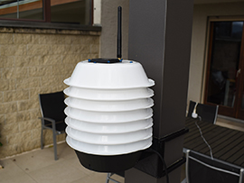
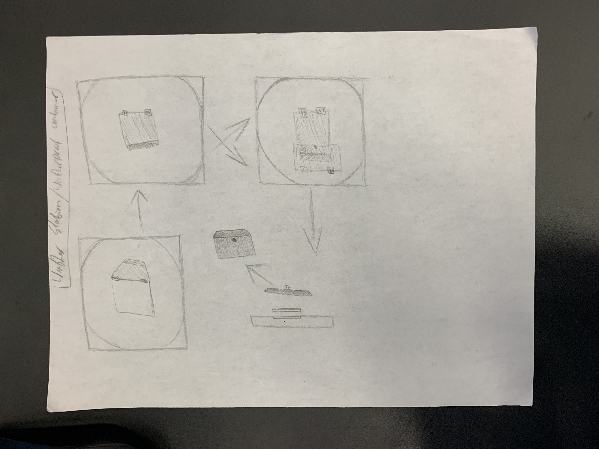
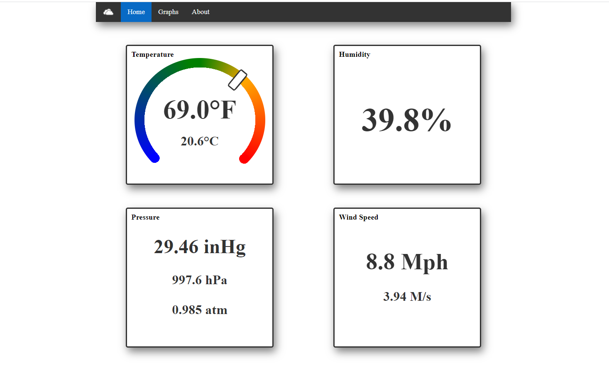
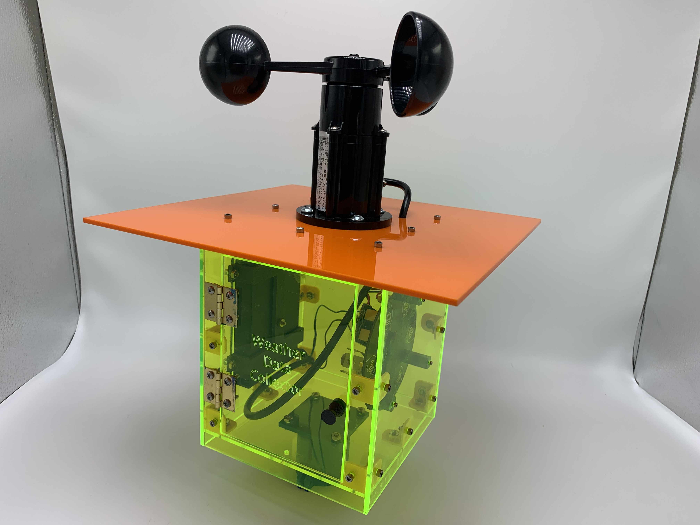
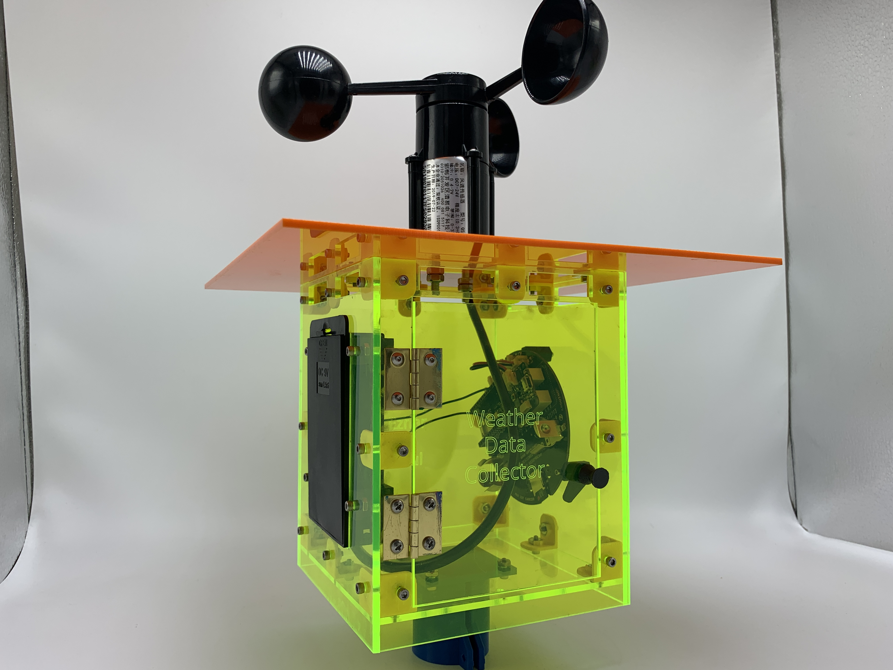

# WeatherCollector
This is the repository for Paul and Ezhar's Engineering III Weather Data Collection project

## Table of Contents
* [Overview](#overview)
* [Design](#design)
* [Code Prototypes](#code-prototypes)
* [Final Arduino Code](#final-arduino-code)
* [Web Dashboard](#web-dashboard)
* [CAD](#cad)
* [Assembly](#assembly)
* [Final Results](#final-results)

 
 

## Additional Documentation
* [Plan](docs/plan.md)
* [Research](docs/research.md)

 
 

## Overview

The first project of Engineering III was to create a **robot arm**. However, as the Engineering program was working on a project to bring a wind turbine onto the school grounds, we (Ezhar Zahid and Paul Schakel) were recruited to gather data on the weather at the school. After much planning and deliberation, we settled on a design that would gather data on *Temperature, Humidity, Pressure, and Wind Speed*. This data would then be sent to the cloud and be displayed on a public dashboard. For more details on the initial design, see our [plan](docs/plan.md).

 

## Tools Used
- CAD - [Onshape](https://www.onshape.com/en/)

- Code - [VS Code](https://code.visualstudio.com/)

- Wiring Diagram - [Fritzing](https://fritzing.org/)

- Arduino Communication - [Arduino IoT Cloud](https://docs.arduino.cc/cloud/iot-cloud)

- Webhooks Integration - [IFTTT](https://ifttt.com/)

- Web Hosting - [Python Anywhere](https://pythonanywhere.com)

 
 

## Design

In the design for our enclosure, we had to take several factors into account: space for sensors, air access, and most importantly **Weather Proofing**. The latter two were somewhat in conflict, so we had to figure out how to let the sensors have access to outside air, while still being waterproof. Our initial idea was to have a circular box with several layers with gaps underneath (similar to image below), but this proved to be too inefficient with the material, and it was scrapped. The design we eventually went with used an overhanging roof with small air slots just beneath it.

Left - Initial idea for weatherproofing

Right - Initial design for door on top - scrapped soon afterward as we needed to put the wind guage on top. Note that the design is ambuguous as to what shape the enclosure would be.

 
 

## Code Prototypes

Before getting very far, we had to create prototypes of the sensors and various components of the project as a proof of concept. Upon completion, several of the prototypes were brought into the [final code](#final-code) for the Arduino, following some modification.

### List of Prototypes
* [MKR Carrier](prototypes/MKR_Carrier/MKR_Carrier.ino) - prototype of OLED screen and capacative touch buttons
* [Humidity and Temperature](prototypes/humidity_temp/humidity_temp.ino) - prototype of Humidity and Temperature sensors on MKR Carrier
* [Pressure and Temperature](prototypes/pressure_temp/pressure_temp.ino) - prototype of Pressure and Temperature sensors - not used in final design
* [WiFi Connection](prototypes/wifi_connection/wifi_connection.ino) - prototype of WiFi connection on Arduino MKR 1010 - used different method in final design
* [Wind Speed](prototypes/wind_speed/wind_speed.ino) - prototype of Wind Speed sensor (Anemometer)

Some of the prototypes weren't used in the final design, such as the prototype of the Pressure and Temperature sensor, which was scrapped because we discovered later on that the MKR Carrier has a pressure sensor, and adding another component didn't really make sense. Most of the prototypes were smooth sailing, just a simple job of looking up an example and testing it out. However, we did have some trouble with the Wind Speed sensor. 

The Wind Speed sensor is supposed to output a voltage between 0.4V and 2V, but when we initially tested it, all we could read was random voltages that had no bearing on wind speed. After messing with the wiring for a while, we realized that it wasn't sharing a ground connection with the Arduino. After connecting the Wind Speed sensor to ground, it worked perfectly.

 
 

## Final Arduino Code

Creating the final version of the code seemed like a simple task at first - simply slapping all the prototypes into one file and calling it a day. However, some unforseen difficulties with the wifi connection prototype required a whole new solution, and additional features, such as storing the data on an SD card, were needed. Unfortunately, these additional tasks led to some small setbacks in terms of timelyness.

### Arduino IoT Cloud

The solution to our internet communication problem turned out to be using the official method [hosted by Arduino](https://docs.arduino.cc/cloud/iot-cloud). In a very short time, we were able to get our Arduino sending data to the cloud and see a live dashboard with the most recent data. However, it did have some issues that will be addressed later.

### Sensors

There weren't any major issues with the sensors, as it was just pasting from the prototypes, but there had to be some changes made in terms of which sensors were used. Our original idea was to use the sensors from the IoT Shield as well as an external sensor for temperature and pressure. However, the I2C connection from the external sensor into the Arduino MKR 1010 made the WiFi module unable to connect. Luckily, the IoT Shield had a barometric pressure module that we had previously overlooked, and a crisis was averted.

### Images and Links

[Link To Final Arduino Code](/arduino_code/WeatherStation.ino)

This is where we would usually put an image of the wiring, but all of the sensors except the anemometer were built into the Arduino IoT Shield, and the wiring from the anemometer was just an analog input to the Arduino and a battery connection. With this in mind it seemed trivial enough to omit the wiring but if more information on the wiring for the anemometer is needed, see [this article](https://how2electronics.com/measure-wind-speed-using-anemometer-arduino/).

### Reflection

The Arduino side of the programming was fairly simple, but probably took longer than it should have. We should have done more planning before launching into the prototyping process, which would have saved some time wasted in creating prototypes unused in the final project. The only real problems that we encountered writing the code were technical difficulties to do with Arduino Create, their website for programming Arduinos, which was not allowing us to upload sketches to the Arduino. My solution was simply to use [VS Code](https://code.visualstudio.com/) instead.

 
 

## Web Dashboard

The Web Dashboard was the most complicated part of the project, since it needed a lot of backend work as well as some design. The most sophisticated part of the dashboard was the use of webhooks to communicate between the Arduino and the cloud server, as well as to display data in the browser. The website is available at [chsweather.pythonanywhere.com](https://chsweather.pythonanywhere.com)

### Backend

The back end of the website was written in Python using the [Flask framework](https://flask.palletsprojects.com/en/2.0.x/), making use of webhooks to do most of the heavy lifting in terms of data transfer into and out of the main database. These webhooks recieved data from the Arduino (which was first piped through [Arduino IoT Cloud](https://docs.arduino.cc/cloud/iot-cloud) and [IFTTT](https://ifttt.com/)), storing it in the database from which it could be accessed by via two other webhooks that found the most recent data value and the data for graphs, respectively. For more information on how to make use of webhooks in projects see [this article.](https://www.markheath.net/post/basic-introduction-webhooks)

### Frontend

The user facing side of the website was fairly difficult, as neither of us have much skill in design, but we managed. The design was created with pure HTML/CSS, with JavaScript to add functionality. [Charts.js](https://www.chartjs.org) was used to generate the graphs, but the rest of the design was written from scratch. The temperature guage was particularly difficult to pull off, requiring quite a bit of math to get the indicator in the correct position.

### Images

The home page of the website - displaying the most up to date sensor readings

The graph page of the website - showing all the available data averaged by day

### Reflection

The Web Dashboard was one of the most time consuming parts of the project, and for good reason - it wasn't particularly straightforward. However, there was considerable time lost on the aforementioned temperature guage, which probably took about twice as long as it should have. Remembering the scope of a project is definitely important, especially when under time constraints, and we somewhat strayed from that path in the design of the website. That isn't to say that we wasted a ton of time, but it could have been better. At least we found some useful and time saving tools along the way:

* [Validating CSS](https://codebeautify.org/cssvalidate)

* [Formatting CSS](https://codebeautify.org/css-beautify-minify)

* [Opening local development environment to web](https://ngrok.com)

All in all, creating the weather station website definitely improved our skills as developers as well as our understanding of how the web works, with webhooks and API calls flying all over the place to create the beautiful mess that the modern internet is today.

 
 

## CAD

The enclosure for the weather station had several requirements, the most important of which were **weather proofing** and **airflow**. Since the weather station was to be outside at all times, the electronics had to be protected from the elements. However, the sensors couldn't be comepletely isolated from the weather because they needed to be able to measure it.

### Weather Proofing
    
The measures we took to weather proof the enclosure had to go hand in hand with measures to retain airflow. With this in mind, we made sure that holes at the top of the enclosure to let in air would be covered by an extended roof on top of the box. Additionally, we used more brackets to hold the enclosure together than was strictly necessary so that we could be more confident that water wouldn't slip between the walls of the box. By considering weather proofing at every stage of the design, we were able to come up with a final design that could withstand almost any weather that it might encounter.

### Images and Links

[Link to Onshape design](https://cvilleschools.onshape.com/documents/513e7211a424748dcd89b2b6/w/52ee4db75103f561a75d491c/e/53e7a17418f6ffe4f5469b6c)

The inside of the enclosure

The outside of the enclosure

### Reflection

The CAD design went through **many** changes as it progressed, with the **airvent holes** and design of the **Top** being the major ones. Many other small changes had to be made as we further developed the design, such as the positioning of the **Arduino MKR** screw holes, the measurements of the **windgauge**, and the cut-outs for the **battery** and the **door**. Many of these small changes took longer than they should have because we didn't initially make use of variables in the design, which would have sped up the process of making modifications tremendously.

 
 

## Final Results

The last step of our project was to fabricate and assemble the final product, a step which unfortunately took us far too long to get to. The assembly was a rather tedious process, as the enclosure had been designed with a very large numbers of brackets, which needed to all be screwed in. Also, the small space inside the box made some things very difficult, such as plugging things into the Arduino and getting things situated inside. However, we were very happy with our results after putting in some work and elbow grease.

### Images

The front and door of the enclosure. The anemometer (wind speed guage) is on the top.

A lower view of the encloser. The battery pack is shown on the left side and the Arduino MKR 1010 with its IoT shield is visible on the inner right side. 

### Reflection

We ran into some issues with connecting the battery pack, Arduino, and anemometer which basically came down to not putting things together in order. As with most things, we could have avoided this mistake by planning more beforehand. Speaking of planning, we *definitely* should have planned more for this project, as we didn't really have a concrete plan going into it, and we did not stay on time with our deadlines. The first part of our project is still in need of some bugfixes and more testing before going into production.
